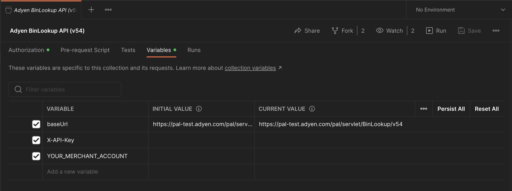

# How to run this code and contribute

__NOTE : This part is meant for the authors of that repository and you probably shouldn't be doing it :)__.

## Setup

Most of the magic here resides in the [trigger-postman.yml](./.github/workflows/trigger-postman.yml) workflow.
This workflow can either be triggered [directly from the UI](.
), though typically it is automatically triggered every time the [adyen-openapi](https://github.com/Adyen/adyen-openapi/blob/main/.github/workflows/notify.yml) repository is updated.

It relies on two different custom actions : 

* The [openapi-generator-postman-v2](https://github.com/gcatanese/openapi-generator-postman-v2) which is used to transform OpenAPI specifications into a Postman compatible format.
* The [push-adyen-collections-to-postman-javascript-action](https://github.com/jlengrand/push-adyen-collections-to-postman-javascript-action/) which uses the Postman API to push those files to the [Postman AdyenDev workspace](https://www.postman.com/adyendev/workspace/adyen-apis/overview).

## Workflow

TODO 

## Automation

* `generateAll.sh` generates all postman API collection files for all versions of the OpenAPI definitions and places them in the postman folder. It is meant to run inside the [dedicated docker image](https://github.com/gcatanese/openapi-generator-postman-v2/).
* `runDocker.sh` is the script that actually runs `generateAll.sh` inside the docker image. 

### Variables

TODO

