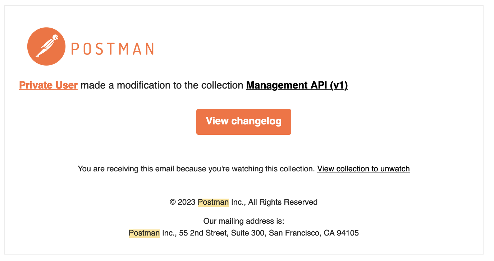

# Adyen Postman

**TL;DR : Visit our always up to date [Postman workspace](https://www.postman.com/adyendev/) to access all of our APIs.**

This repository contains declaration files in the [Postman](https://postman.com/) format. The files are automatically generated based on the latest [adyen-openapi](https://github.com/adyen/adyen-openapi) definition files.
They are then uploaded on our [AdyenDev](https://www.postman.com/adyendev/) Postman space and you can fork it from there. You can also directly pick the `.json` files available here and upload them if you prefer.

## Using the [AdyenDev](https://www.postman.com/adyendev) workspace

The preferred way to use these files is to fork the [Adyen APIs](https://adyendev.postman.co/workspace/Adyen-APIs~a8d63f9f-cfc7-4810-90c5-9e0c60030d3e) Postman workspace. 

This way you will be notified of new versions and changes per email and in the UI directly.

## Importing the JSON files

However, in case you want to experiment, want to keep your experiments, want to use an older version of any of our APIs or if you're using a postman alternative like [Insomnia](https://docs.insomnia.rest/insomnia/import-export-data) or [Hoppscotch](https://hoppscotch.io/), you can also take any of the json files in this repository and upload them yourself.

## Setup

Before running API calls, you will have to set some variables. Those depend on which API you are using, but you will recognize them because they are between braces (`{{X-API-Key}}`).
Notably, you will find those in the `Authorization` as well as the `Variables` tabs in each collection. 

.

Instead of directly modifying them there, we recommend you instead to create [Environments](https://learning.postman.com/docs/sending-requests/managing-environments/). This way, you can switch from test to production without much hassle when running your API calls. Environments are also nice to protect secret values, like your API Keys. 

To do this, you can either :

* Fork the [Adyen APIs](https://www.postman.com/adyendev/workspace/adyen-apis/overview) environment we provide, and override the variables there.
* Create a new environment from scratch using the corresponding left tab in the Postman UI, and override the variables there.

.

## Support
If you have a feature request, or spotted a bug or a technical problem, [create a GitHub issue](https://github.com/Adyen/adyen-postman/issues/new/choose). For other questions, contact our [support team](https://www.adyen.help/hc/en-us/requests/new).

## License
MIT license. For more information, see the LICENSE file.
